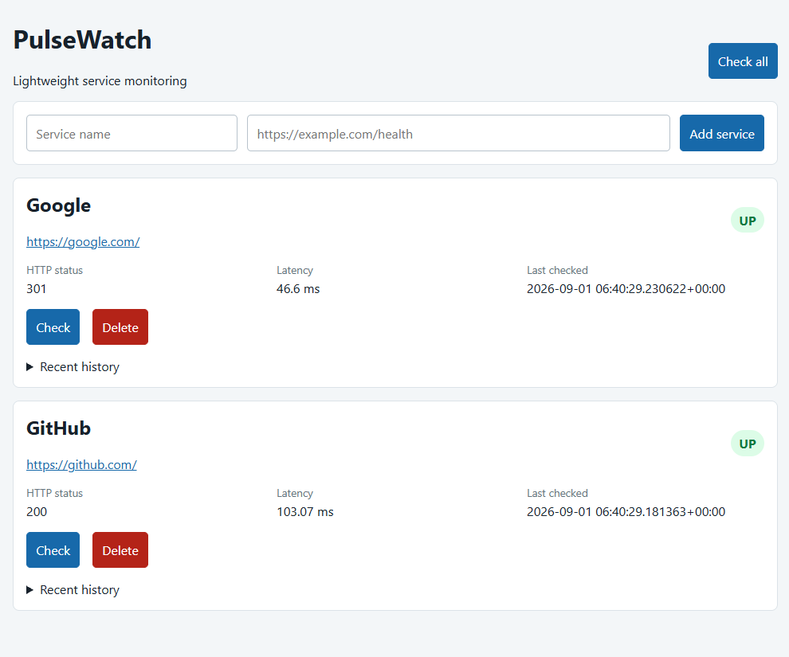
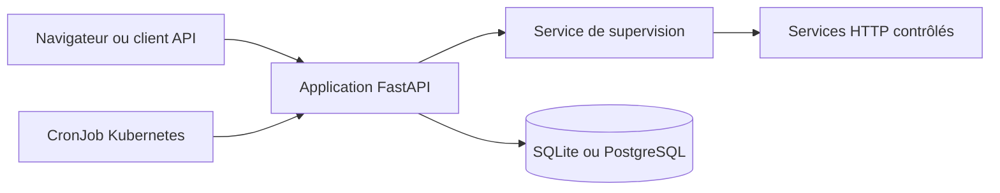
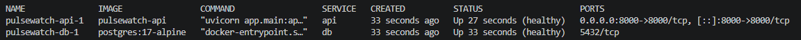
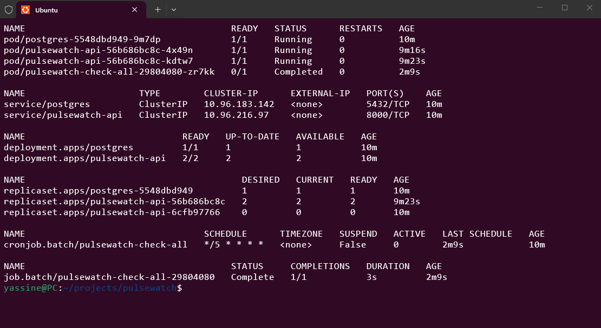

# PulseWatch

[](https://github.com/yassinewasel/pulsewatch/actions/workflows/ci.yml)

PulseWatch est une application légère de supervision de services Web. Elle enregistre des adresses HTTP ou HTTPS, vérifie leur disponibilité, mesure leur temps de réponse et conserve l'historique des contrôles.



## Fonctionnalités

- ajout et suppression de services ;
- validation des adresses avant enregistrement ;
- contrôle individuel ou groupé ;
- classement `UP` pour les réponses HTTP 2xx et 3xx ;
- classement `DOWN` en cas d'erreur réseau ou de délai dépassé ;
- mesure de la latence et conservation du code HTTP ;
- tableau de bord HTML avec historique récent ;
- endpoints distincts de vivacité et de disponibilité ;
- stockage SQLite en local ou PostgreSQL avec Docker ;
- contrôles planifiés par un CronJob Kubernetes.

## Architecture



Les routeurs exposent le tableau de bord et l'API, les services contiennent la logique de contrôle HTTP, et les modèles SQLAlchemy gèrent la persistance.

## Technologies

Python 3, FastAPI, SQLAlchemy 2, PostgreSQL, SQLite, httpx, Jinja2, HTML, CSS, JavaScript natif, pytest, Docker, Docker Compose, GitHub Actions, Kubernetes, kubectl, kind, Linux et WSL2.

## API REST

| Méthode | Endpoint | Rôle |
| --- | --- | --- |
| `GET` | `/api/services` | Lister les services surveillés |
| `POST` | `/api/services` | Enregistrer un service |
| `DELETE` | `/api/services/{id}` | Supprimer un service |
| `POST` | `/api/services/{id}/check` | Contrôler un service |
| `POST` | `/api/services/check-all` | Contrôler tous les services |
| `GET` | `/api/services/{id}/checks` | Consulter l'historique |
| `GET` | `/health` | Vérifier que l'application répond |
| `GET` | `/ready` | Vérifier la disponibilité de la base |

La documentation interactive est disponible sur `/docs` lorsque l'application est lancée.

## Exécution locale

```bash
python3 -m venv .venv
source .venv/bin/activate
python -m pip install --upgrade pip
python -m pip install -r requirements.txt
cp .env.example .env
pytest -v
uvicorn app.main:app --reload
```

Ouvrir ensuite [http://127.0.0.1:8000](http://127.0.0.1:8000). La configuration d'exemple utilise SQLite et ne nécessite pas de serveur PostgreSQL séparé.

## Docker Compose

Docker Compose lance l'API et PostgreSQL ensemble. L'API utilise le nom de service `db` et les données sont conservées dans un volume nommé.

```bash
cp .env.example .env
docker compose config
docker compose up --build -d
docker compose ps
```



```bash
docker compose logs -f
docker compose down
```

La commande `docker compose down` conserve le volume. Utiliser `docker compose down -v` uniquement pour supprimer volontairement les données locales.

## Kubernetes local

Le dossier `k8s/` contient un déploiement kind avec deux réplicas API, PostgreSQL, un volume persistant, des services internes, une ConfigMap, un Secret local, des sondes de vivacité et de disponibilité ainsi qu'un CronJob.



La procédure complète se trouve dans [k8s/README.md](k8s/README.md).

## Tests et intégration continue

```bash
pytest -v
```

Les tests utilisent SQLite de manière isolée et simulent les appels HTTP. Ils ne nécessitent ni PostgreSQL lancé ni service externe. GitHub Actions exécute les tests et vérifie la construction de l'image Docker lors des pull requests et des mises à jour de `main`.

## Vivacité et disponibilité

`GET /health` vérifie que le processus FastAPI répond sans dépendre de PostgreSQL. `GET /ready` vérifie que les dépendances nécessaires sont accessibles. Kubernetes utilise ces deux endpoints pour distinguer un processus vivant d'une application prête à recevoir du trafic.

## Périmètre et licence

PulseWatch est un projet pédagogique de portfolio présentant la supervision de services, la persistance, la conteneurisation, l'intégration continue et Kubernetes local. Il ne se présente pas comme une plateforme de supervision de production.

Le projet est distribué sous licence [MIT](LICENSE).
