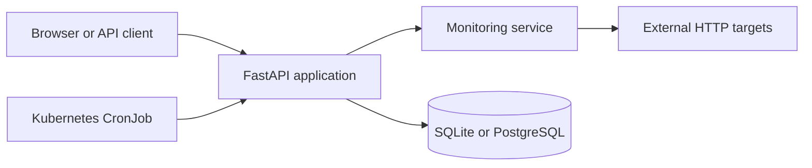

# PulseWatch

[](https://github.com/yassinewasel/pulsewatch/actions/workflows/ci.yml)

PulseWatch is a lightweight service monitoring application built to demonstrate a complete development workflow, from a FastAPI application and PostgreSQL persistence to automated tests, Docker Compose, GitHub Actions, and a local Kubernetes deployment.


## What PulseWatch does

PulseWatch registers HTTP services, checks their availability, measures response latency, and keeps a history of every result. The dashboard provides a compact view of service status and allows checks to be started individually or in bulk.

Main features:

- register and remove monitored HTTP or HTTPS services;
- validate monitoring URLs before storage;
- run individual or bulk availability checks;
- classify successful 2xx and 3xx responses as `UP`;
- record `DOWN` results without crashing when a service times out or fails;
- measure response latency and store HTTP status codes;
- display recent check history in a server-rendered dashboard;
- expose separate liveness and database-readiness endpoints;
- persist data in SQLite locally or PostgreSQL with containers;
- schedule bulk checks with a Kubernetes CronJob.

## Architecture



The application uses a small layered structure:

- `app/routers/` contains the dashboard and REST endpoints;
- `app/services/` contains the HTTP monitoring logic;
- `app/models/` and `app/database.py` manage SQLAlchemy persistence;
- `app/templates/` and `app/static/` provide the HTML, CSS, and JavaScript interface;
- `tests/` contains isolated pytest coverage;
- `k8s/` contains the local kind deployment.

## Technology stack

- Python 3 and FastAPI
- SQLAlchemy 2
- PostgreSQL and SQLite
- httpx
- Jinja2, HTML, CSS, and vanilla JavaScript
- pytest
- Docker and Docker Compose
- GitHub Actions
- Kubernetes, kubectl, and kind
- Linux and WSL2

## REST API

| Method | Endpoint | Purpose |
| --- | --- | --- |
| `GET` | `/api/services` | List monitored services |
| `POST` | `/api/services` | Register a service |
| `DELETE` | `/api/services/{id}` | Remove a service |
| `POST` | `/api/services/{id}/check` | Check one service |
| `POST` | `/api/services/check-all` | Check every service |
| `GET` | `/api/services/{id}/checks` | Read check history |
| `GET` | `/health` | Verify that the API process is alive |
| `GET` | `/ready` | Verify application and database readiness |

Interactive OpenAPI documentation is available at `/docs` while the application is running.

## Run locally with Python

```bash
python3 -m venv .venv
source .venv/bin/activate
python -m pip install --upgrade pip
python -m pip install -r requirements.txt
cp .env.example .env
pytest -v
uvicorn app.main:app --reload
```

Open [http://127.0.0.1:8000](http://127.0.0.1:8000).

The example configuration uses SQLite so local development does not require a separate database server. To use PostgreSQL, provide a valid SQLAlchemy `DATABASE_URL` through the environment.

## Run with Docker Compose

Docker Compose starts the API and PostgreSQL together. The API connects to the `db` service name and PostgreSQL data is stored in a named volume.

```bash
cp .env.example .env
docker compose config
docker compose up --build -d
docker compose ps
```


Useful commands:

```bash
docker compose logs -f
docker compose down
```

`docker compose down` keeps the database volume. Use `docker compose down -v` only when the stored development data should be deleted intentionally.

## Run on a local Kubernetes cluster

The `k8s/` directory demonstrates a local kind deployment with:

- two PulseWatch API replicas;
- one PostgreSQL replica and a persistent volume claim;
- internal Services for the API and database;
- a ConfigMap and a local Secret template;
- liveness and readiness probes;
- a CronJob that runs bulk checks every five minutes;
- self-healing and manual scaling through a Deployment.


The full procedure is documented in [k8s/README.md](k8s/README.md).

## Tests and continuous integration

```bash
pytest -v
```

Tests use isolated SQLite databases and mocked HTTP calls, so they do not require a running PostgreSQL server or external monitored service. GitHub Actions runs the test suite and validates that the Docker image builds on pull requests and pushes to `main`.

## Health model

`GET /health` is a liveness check. It confirms that the FastAPI process can answer requests without depending on PostgreSQL.

`GET /ready` is a readiness check. It verifies the database dependency and returns a failure response when the application is not ready to serve normal traffic. Kubernetes uses these endpoints for separate liveness and readiness probes.

## Project scope

PulseWatch is an educational portfolio project. It demonstrates service monitoring, persistence, containerization, continuous integration, and local Kubernetes concepts without claiming to be a production monitoring platform.

## License

This project is distributed under the [MIT License](LICENSE).
